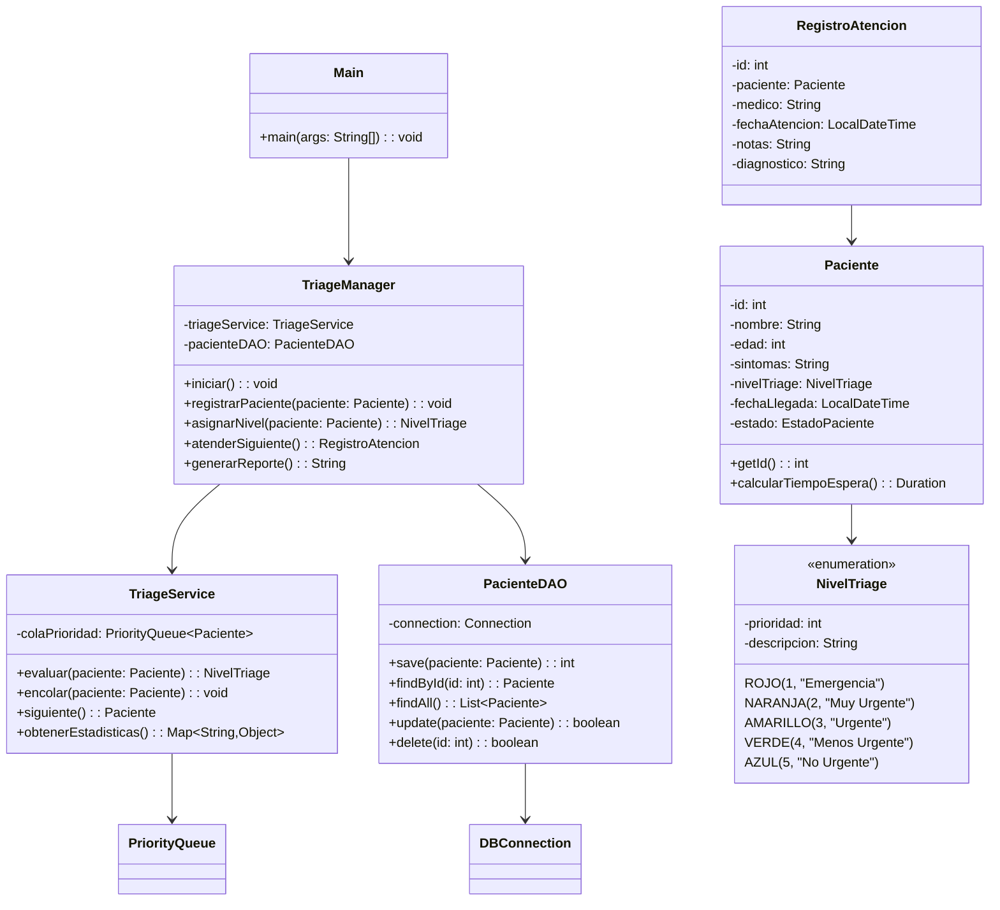
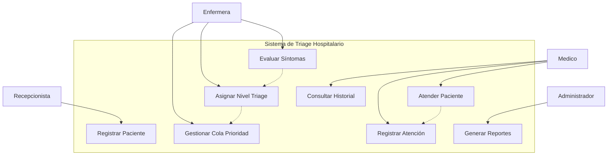

# 🏥 Sistema de Triage Hospitalario

Un sistema de gestión de triage para áreas de urgencias implementado en Java, que permite la clasificación automática de pacientes según su nivel de urgencia médica y gestión eficiente de colas de atención.

## 📋 Características Principales

- **Registro automático** de pacientes al llegar al hospital
- **Evaluación de síntomas** y asignación automática de nivel de triage
- **Cola de prioridad** inteligente basada en urgencia médica
- **Seguimiento completo** del proceso de atención
- **Reportes y métricas** del sistema de urgencias
- **Persistencia de datos** con base de datos PostgreSQL/Supabase

## 🎯 Niveles de Triage

| Nivel | Color | Descripción | Tiempo Máximo de Espera |
|-------|-------|-------------|--------------------------|
| 🔴 **Rojo** | Emergencia | Riesgo vital inmediato | 0 minutos |
| 🟠 **Naranja** | Muy Urgente | Riesgo vital potencial | 10 minutos |
| 🟡 **Amarillo** | Urgente | Requiere atención pronta | 60 minutos |
| 🟢 **Verde** | Menos Urgente | Puede esperar | 120 minutos |
| 🔵 **Azul** | No Urgente | Consulta general | 240 minutos |

## 🛠️ Tecnologías Utilizadas

- **Java 17+** - Lenguaje principal
- **JDBC** - Conectividad con base de datos
- **PostgreSQL/MySQL** - Sistema de gestión de base de datos
- **Maven/Gradle** - Gestión de dependencias
- **JUnit 5** - Testing unitario

## 📂 Estructura del Proyecto

```
src/
├── main/java/
│   ├── controller/
│   │   └── TriageManager.java          # Controlador principal
│   ├── dao/
│   │   ├── DBConnection.java           # Conexión a BD
│   │   └── PacienteDAO.java            # Acceso a datos de pacientes
│   ├── model/
│   │   ├── Paciente.java               # Modelo de paciente
│   │   ├── RegistroAtencion.java       # Registro de atención médica
│   │   └── NivelTriage.java            # Enumeración de niveles
│   ├── service/
│   │   └── TriageService.java          # Lógica de negocio
│   ├── util/
│   │   └── PriorityQueue.java          # Cola de prioridad personalizada
│   └── Main.java                       # Punto de entrada
├── test/java/                          # Tests unitarios
└── resources/
    ├── application.properties          # Configuración
    └── schema.sql                      # Scripts de BD
```

## 🚀 Instalación y Configuración

### Prerrequisitos
- Java JDK 17 o superior
- PostgreSQL 12+ o MySQL 8.0+
- Maven 3.6+ o Gradle 7.0+

### Pasos de Instalación

1. **Clonar el repositorio**
   ```bash
   git clone https://github.com/tu-usuario/sistema-triage-urgencias.git
   cd sistema-triage-urgencias
   ```

2. **Configurar la base de datos**
   ```bash
   # Crear base de datos
   createdb triage_hospital
   
   # Ejecutar scripts de esquema
   psql -d triage_hospital -f src/main/resources/schema.sql
   ```

3. **Configurar conexión**
   ```properties
   # src/main/resources/application.properties
   db.url=jdbc:postgresql://localhost:5432/triage_hospital
   db.username=tu_usuario
   db.password=tu_contraseña
   ```

4. **Compilar y ejecutar**
   ```bash
   # Con Maven
   mvn clean compile exec:java -Dexec.mainClass="Main"
   
   # Con Gradle
   ./gradlew run
   ```

## 📊 Diagramas UML

### Diagrama de Clases


### Diagrama de Casos de Uso


## 👥 Roles de Usuario

### 🏥 Recepcionista
- Registrar llegada de pacientes
- Capturar datos básicos de identificación

### 👩‍⚕️ Enfermera de Triage
- Evaluar signos vitales y síntomas
- Asignar nivel de triage según protocolo
- Gestionar cola de prioridad

### 👨‍⚕️ Médico
- Atender pacientes según prioridad
- Registrar diagnóstico y tratamiento
- Consultar historial médico

### 👨‍💼 Administrador
- Generar reportes estadísticos
- Configurar parámetros del sistema
- Gestionar usuarios y permisos

## 📈 Funcionalidades Avanzadas

- **Algoritmo de priorización inteligente** basado en síntomas y signos vitales
- **Notificaciones automáticas** para tiempos de espera críticos
- **Dashboard en tiempo real** del estado de urgencias
- **Integración con sistemas hospitalarios** existentes
- **Auditoría completa** de todas las acciones del sistema

## 🧪 Testing

```bash
# Ejecutar todos los tests
mvn test

# Ejecutar tests específicos
mvn test -Dtest=TriageServiceTest

# Generar reporte de cobertura
mvn jacoco:report
```

## 📝 Contribuir al Proyecto

1. Fork del repositorio
2. Crear rama para nueva funcionalidad (`git checkout -b feature/nueva-funcionalidad`)
3. Commit de cambios (`git commit -m 'Agregar nueva funcionalidad'`)
4. Push a la rama (`git push origin feature/nueva-funcionalidad`)
5. Crear Pull Request

## 📄 Licencia

Este proyecto está bajo la Licencia MIT. Ver el archivo [LICENSE](LICENSE) para más detalles.

## 👨‍💻 Equipo de Desarrollo

- **[Tu Nombre]** - *Desarrollador Principal* - [@tu-usuario](https://github.com/tu-usuario)
- **[Nombre del Compañero]** - *Desarrollador* - [@usuario-companero](https://github.com/usuario-companero)

## 📞 Contacto

Si tienes preguntas sobre el proyecto, no dudes en contactarnos:

- **Email**: tu-email@universidad.edu
- **GitHub Issues**: [Crear nuevo issue](https://github.com/tu-usuario/sistema-triage-urgencias/issues/new)

## 🙏 Agradecimientos

- Profesores de la materia de Estructuras de Datos
- Personal médico que proporcionó insights sobre procesos de triage
- Comunidad open source por las librerías utilizadas

---

⭐ **¡No olvides dar una estrella al proyecto si te ha sido útil!**
