# 🏥 Sistema de Triage Hospitalario

Un sistema de gestión de triage para áreas de urgencias implementado en Java, que permite la clasificación automática de pacientes según su nivel de urgencia médica y gestión eficiente de colas de atención.

## 📋 Características Principales

- **Registro automático** de pacientes al llegar al hospital
- **Evaluación de síntomas** y asignación automática de nivel de triage
- **Cola de prioridad** inteligente basada en urgencia médica
- **Seguimiento completo** del proceso de atención
- **Reportes y métricas** del sistema de urgencias
- **Persistencia de datos** con base de datos PostgreSQL/Supabase

## 🎯 Niveles de Triage

| Nivel | Color | Descripción | Tiempo Máximo de Espera |
|-------|-------|-------------|--------------------------|
| 🔴 **Rojo** | Emergencia | Riesgo vital inmediato | 0 minutos |
| 🟠 **Naranja** | Muy Urgente | Riesgo vital potencial | 10 minutos |
| 🟡 **Amarillo** | Urgente | Requiere atención pronta | 60 minutos |
| 🟢 **Verde** | Menos Urgente | Puede esperar | 120 minutos |
| 🔵 **Azul** | No Urgente | Consulta general | 240 minutos |

## 🛠️ Tecnologías Utilizadas

- **Java 17+** - Lenguaje principal
- **JDBC** - Conectividad con base de datos
- **PostgreSQL/Supabase** - Sistema de gestión de base de datos

## 📂 Estructura del Proyecto

```
src/
├── main/java/
│   ├── controller/
│   │   └── TriageManager.java          # Controlador principal
│   ├── dao/
│   │   ├── DBConnection.java           # Conexión a BD
│   │   └── PacienteDAO.java            # Acceso a datos de pacientes
│   ├── model/
│   │   ├── Paciente.java               # Modelo de paciente
│   │   ├── RegistroAtencion.java       # Registro de atención médica
│   │   └── NivelTriage.java            # Enumeración de niveles
│   ├── service/
│   │   └── TriageService.java          # Lógica de negocio
│   ├── util/
│   │   └── PriorityQueue.java          # Cola de prioridad personalizada
│   └── Main.java                       # Punto de entrada
├── test/java/                          # Tests unitarios
└── resources/
    ├── application.properties          # Configuración
    └── schema.sql                      # Scripts de BD
```

## 🚀 Instalación y Configuración

### Prerrequisitos
- Java JDK 17 o superior


## 📊 Diagramas UML

### Diagrama de Clases


### Diagrama de Casos de Uso

```mermaid
graph TB
    subgraph "Sistema de Triage Hospitalario"
        UC1[Registrar Paciente]
        UC2[Evaluar Síntomas]
        UC3[Asignar Nivel Triage]
        UC4[Gestionar Cola Prioridad]
        UC5[Atender Paciente]
        UC6[Registrar Atención]
        UC7[Generar Reportes]
        UC8[Consultar Historial]
    end
    
    Recepcionista --> UC1
    Enfermera --> UC2
    Enfermera --> UC3
    Enfermera --> UC4
    Medico --> UC5
    Medico --> UC6
    Medico --> UC8
    Administrador --> UC7
    
    UC2 -.-> UC3
    UC3 -.-> UC4
    UC5 -.-> UC6
```


## 👥 Roles de Usuario

### 🏥 Recepcionista
- Registrar llegada de pacientes
- Capturar datos básicos de identificación

### 👩‍⚕️ Enfermera de Triage
- Evaluar signos vitales y síntomas
- Asignar nivel de triage según protocolo
- Gestionar cola de prioridad

### 👨‍⚕️ Médico
- Atender pacientes según prioridad
- Registrar diagnóstico y tratamiento
- Consultar historial médico

### 👨‍💼 Administrador
- Generar reportes estadísticos
- Configurar parámetros del sistema
- Gestionar usuarios y permisos

## 📈 Funcionalidades Avanzadas

- **Algoritmo de priorización inteligente** basado en síntomas y signos vitales
- **Notificaciones automáticas** para tiempos de espera críticos
- **Dashboard en tiempo real** del estado de urgencias
- **Integración con sistemas hospitalarios** existentes
- **Auditoría completa** de todas las acciones del sistema


## 👨‍💻 Equipo de Desarrollo

- **[Tu Nombre]** - *Desarrollador Principal* - [@tu-usuario](https://github.com/tu-usuario)
- **[Nombre del Compañero]** - *Desarrollador* - [@usuario-companero](https://github.com/usuario-companero)


---

⭐ **¡No olvides dar una estrella al proyecto si te ha sido útil!**
